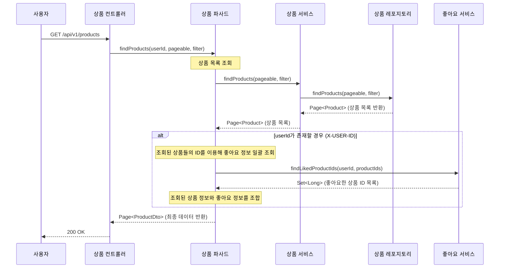
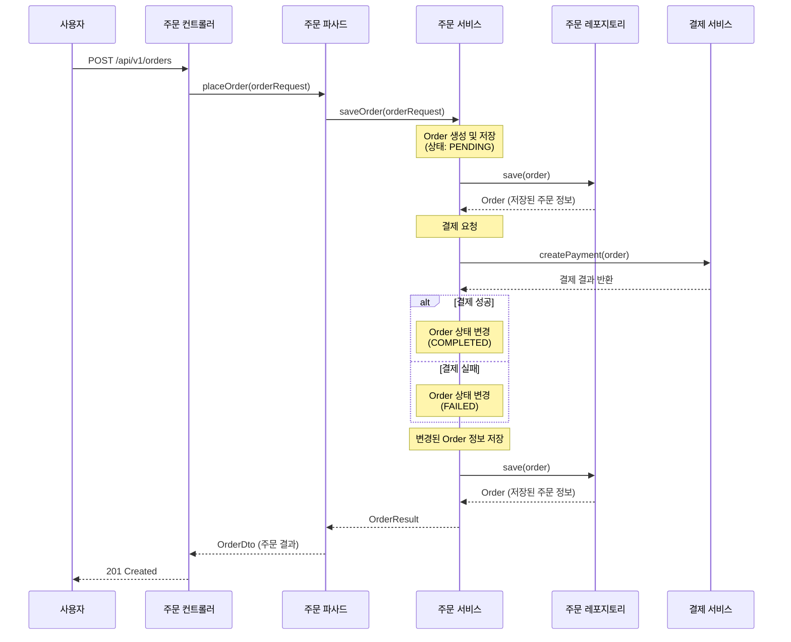
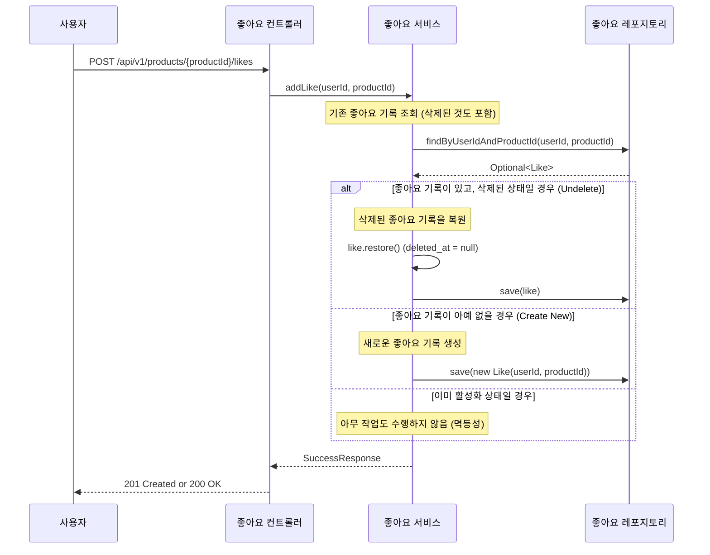
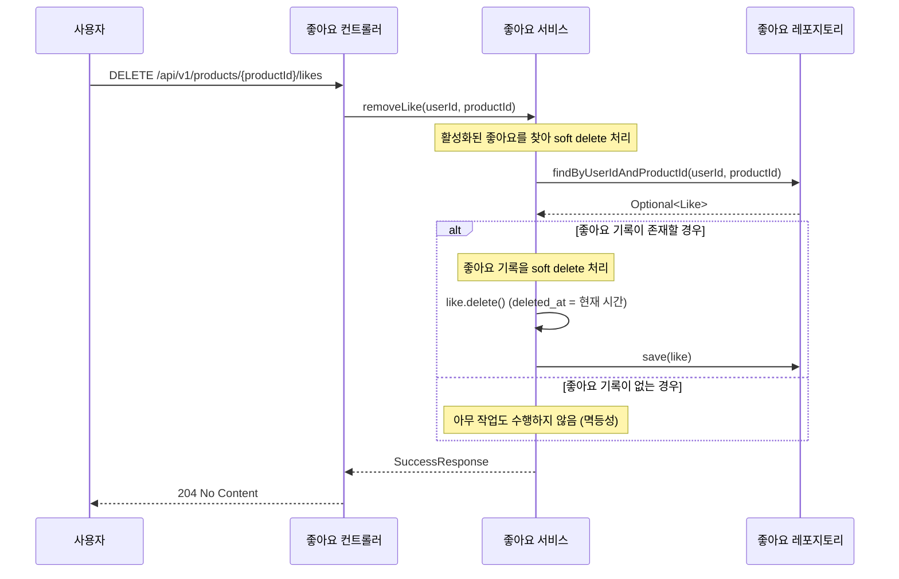
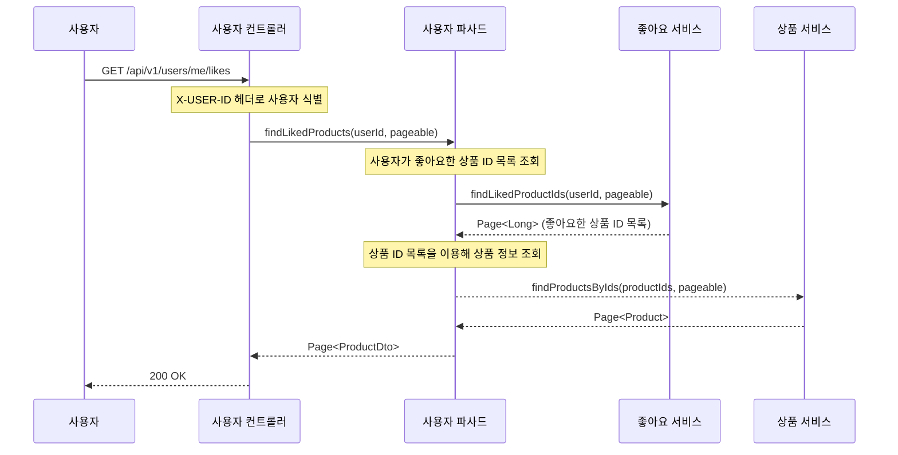

# 시퀀스 다이어그램

1. [상품조회](#1-상품조회)
2. [주문생성](#2-주문생성)
3. [좋아요 등록](#3-좋아요-등록)
4. [좋아요 취소](#4-좋아요-취소)
5. [좋아요 목록 조회](#5-좋아요-목록-조회)

## 1. 상품조회

## 2. 주문생성

## 3. 좋아요 등록

## 4. 좋아요 취소

## 5. 좋아요 누른 상품 목록 조회

