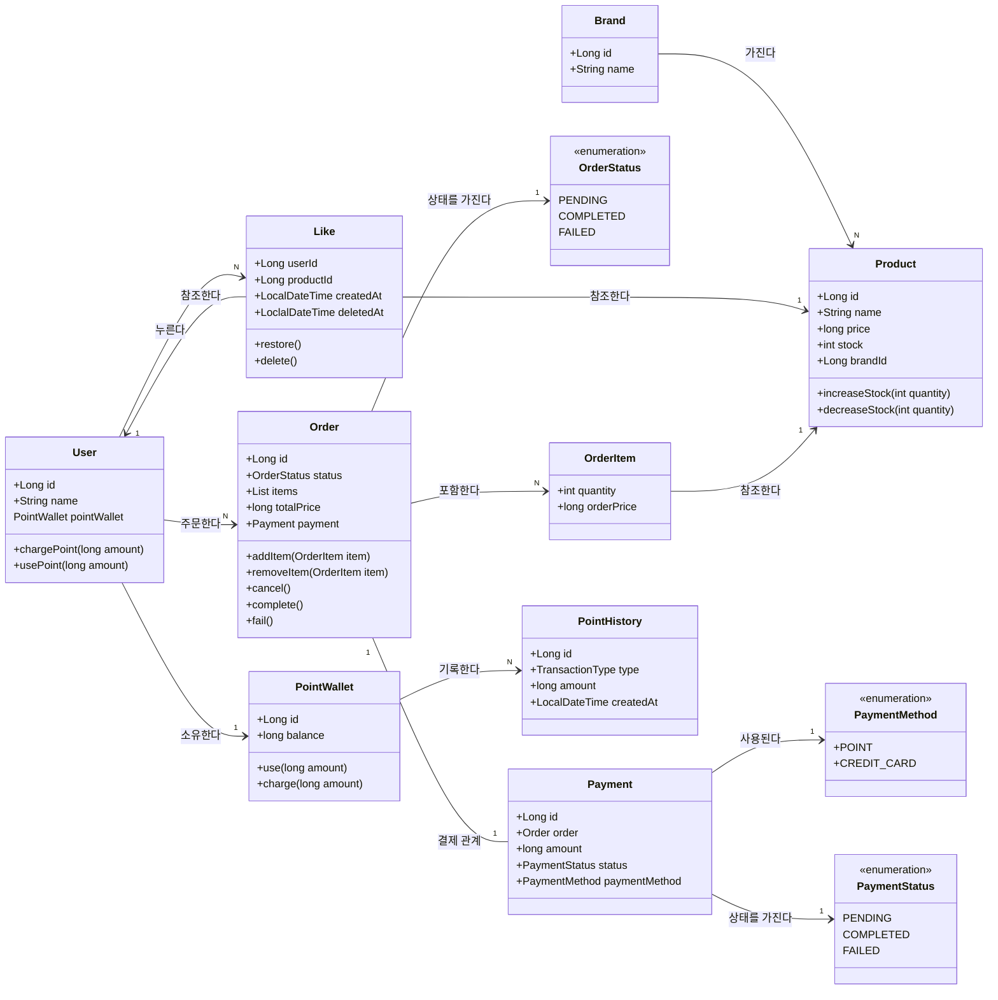

# 클래스 다이어그램

```mermaid
classDiagram
    direction LR

    class User {
        +Long id
        +String name
        PointWallet pointWallet
        +chargePoint(long amount)
        +usePoint(long amount)
    }

    class Product {
        +Long id
        +String name
        +long price
        +int stock
        +Long brandId
        +increaseStock(int quantity)
        +decreaseStock(int quantity)
    }

    class Brand {
        +Long id
        +String name
    }

    class Order {
        +Long id
        +OrderStatus status
        +List<OrderItem> items
        +long totalPrice
        +Payment payment
        +addItem(OrderItem item)
        +removeItem(OrderItem item)
        +cancel()
        +complete()
        +fail()
    }

    class OrderStatus {
        <<enumeration>>
        PENDING
        COMPLETED
        FAILED
    }

    class OrderItem {
        +int quantity
        +long orderPrice
    }

    class Like {
        +Long userId
        +Long productId
        +LocalDateTime createdAt
        +LoclalDateTime deletedAt
        +restore()
        +delete()
    }

    class Payment {
        +Long id
        +Order order
        +long amount
        +PaymentStatus status
        +PaymentMethod paymentMethod
    }

    class PaymentMethod {
        <<enumeration>>
        +POINT
        +CREDIT_CARD
    }

    class PaymentStatus {
        <<enumeration>>
        PENDING
        COMPLETED
        FAILED
    }

    class PointWallet {
        +Long id
        +long balance
        +use(long amount)
        +charge(long amount)
    }

    class PointHistory {
        +Long id
        +TransactionType type
        +long amount
        +LocalDateTime createdAt
    }

    User --> "N" Order: 주문한다
    User --> "N" Like: 누른다
    User --> "1" PointWallet: 소유한다
    Brand --> "N" Product: 가진다
    Like --> "1" Product: 참조한다
    Like --> "1" User: 참조한다
    OrderItem --> "1" Product: 참조한다
    Order --> "N" OrderItem: 포함한다
    Order "1" -- "1" Payment: 결제 관계
    Order --> "1" OrderStatus: 상태를 가진다
    Payment --> "1" PaymentMethod: 사용된다
    Payment --> "1" PaymentStatus: 상태를 가진다
    PointWallet --> "N" PointHistory: 기록한다
```
